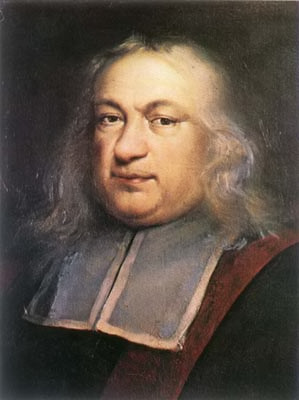
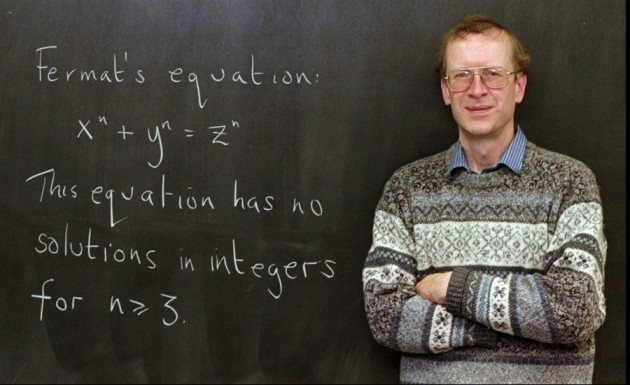
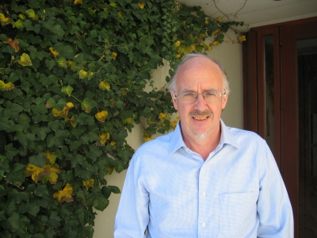
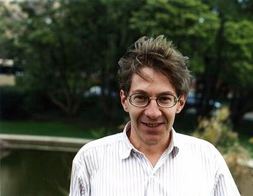
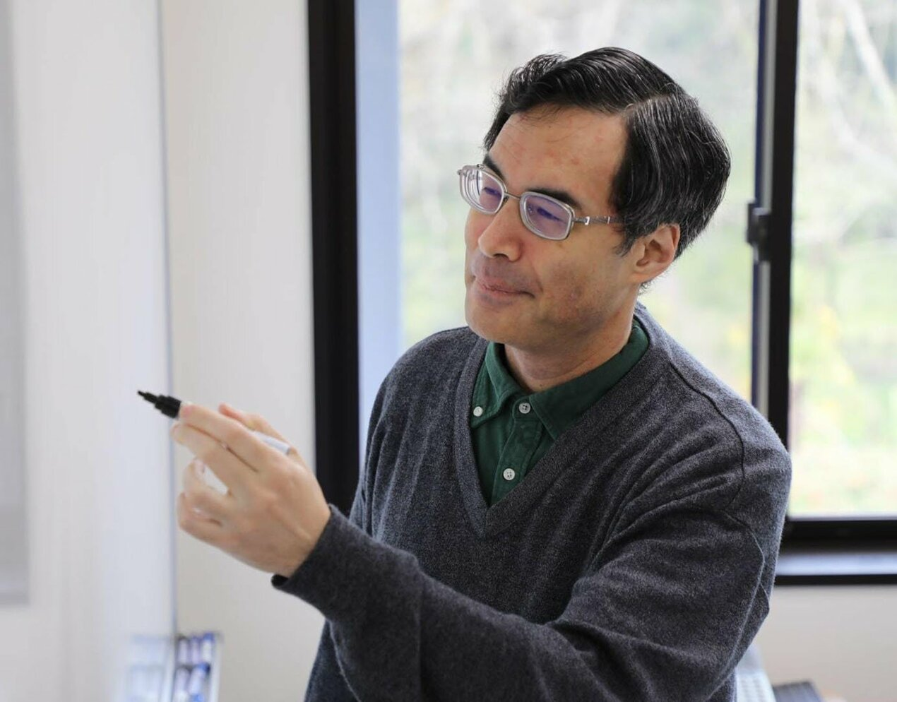
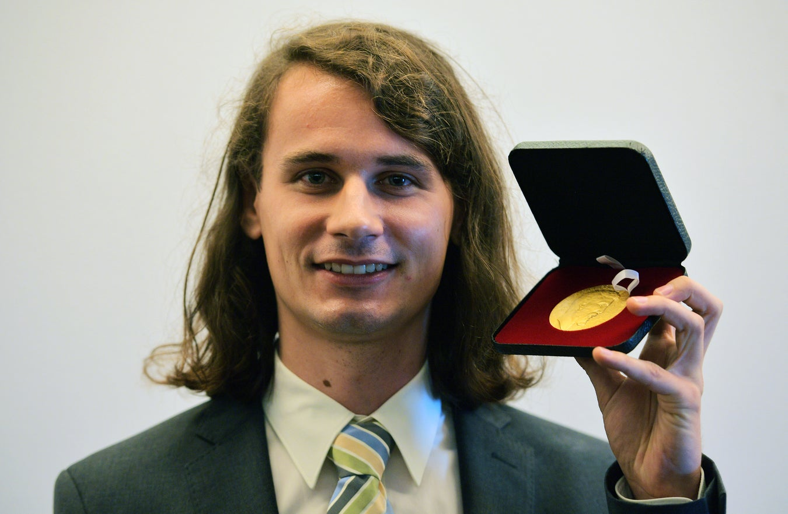
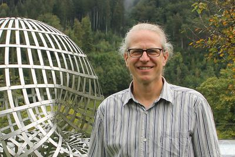

One of the most fundamental theorems that we learn in high school is the Pythagorean Theorem, which states that in a right-angle triangle, the sum of the squares of the two shorter sides is equal to the square of the longer side, i.e., $a^2+b^2=c^2$, where a,b, and c are integers. There are infinitely many solutions for this when a,b, and c are integers. However, when we deal with the case where, instead of 2, it is an integer exponent greater than 2, things start to get a bit weird. Around 1637, Pierre de Fermat claimed that he had a marvelous proof that no three positive integers a,b, and c can satisfy the equation $a^n+b^n=c^n$ for any integer greater than 2. This problem was commonly referred to as Fermat's Last Theorem. Here's a fun fact: Fermat scribbled this claim in the margin of his copy of an ancient Greek mathematics book, adding that the margin was too narrow to contain his proof. Most mathematicians believe Fermat was probably mistaken, he likely had a proof that worked for specific cases (like $n=4$, which he did prove correctly) but thought it worked for all exponents, or he had a flawed proof that he mistakenly believed was correct (see [NSF article](https://www.nsf.gov/news/350-years-later-fermats-last-theorem-finally#:~:text=Mathematics,4%20and%20other%20special%20cases.)). Although Fermat claimed that he solved it but there was no evidence of it. In fact, it took more than 350 years for Andrew Wiles to finally prove Fermat's Last Theorem in 1994. The proof was very complicated and used a lot of modern mathematics like elliptic curves and modular forms. The interesting question was why a tiny change in the exponent from 2 to 3 made such a huge barrier?

Pierre de Fermat

Andrew Wiles, who proved Fermat's Last Theorem in 1994

In 1985, Masser and Oesterle proposed a conjecture known as the abc conjecture. The conjecture deals with three positive integers a, b, and c that are coprime (meaning they share no common prime factors) and satisfy the equation $a + b = c$.

David Masser

Joseph Oesterle

Let's look at a simple example. Take a = 2, b = 3, so c = 5. Here, $2 + 3 = 5$. Notice that all three numbers are coprime meaningthey don't share any common prime factors.

To understand the abc conjecture, we need to know about the "radical" of a number. The radical of a number is the product of all its different prime factors, but we only count each prime once. For example, the number $16 = 2^4$ has radical 2 (just the prime 2, counted once). The number $12 = 2^2 \times 3$ has radical $2 \times 3 = 6$.

Now, here's what the abc conjecture says. When you have three coprime numbers where $a + b = c$, you calculate the radical of the product $abc$. Very roughly speaking, the conjecture says that $c$ usually cannot be too large compared to that radical.

What does "repeated small primes" mean? By "small primes," we mean primes like 2, 3, 5, 7 (small numbers). By "repeated," we mean the same prime appears many times as a factor. For example, $2^{10} = 2 \times 2 \times 2 \times 2 \times 2 \times 2 \times 2 \times 2 \times 2 \times 2$ means the prime 2 is repeated 10 times. The number $2^{10} \times 3^5$ means the prime 2 is repeated 10 times and the prime 3 is repeated 5 times.

The key insight is this: if a and b are both made from small primes (like 2 and 3) raised to high powers, then c will usually bring in enough new prime factors to keep the radical of abc from being too small compared with c. In fact, the radical is usually bigger than c. The interesting cases are when it is smaller, and the abc conjecture says that even then, c cannot get "too much" larger than rad(abc).

For example here is the not so interesting case, if $a = 2^{10} = 1,024$ and $b = 3^{10} = 59,049$, then $c = a+b = 60,073$. Now $60,073 = 13 \times 4,621$. So $\operatorname{rad}(abc) = \operatorname{rad}(2^{10} \cdot 3^{10} \cdot 60,073) = 2 \times 3 \times 13 \times 4,621 = 360,438$. Thus $c$ brings in the new prime factors $13$ and $4,621$, making $\operatorname{rad}(abc) = 360,438 > 60,073 = c$.

Here is the interesting case: $a=3$, $b=125$, and $c=128$.

$\operatorname{rad}(abc)=2 \times 3 \times 5=30 < c=128$.

A natural follow up question is, how much is "too much"?
In everyday terms, if instead of paying 30 dollars for a meal, I had to pay 128 dollars, I would definitely feel that is too much, but what about in the context of abc conjecture?
ABC conjecture does not measure "too much" by the usual subtraction or ordinary ratio, it measures "too much" using powers.

In the case of $\operatorname{rad}(abc)=30$ and $c=128$, we see $30<128<30^{1.5}$, so in this sense, 128 definitely doesn't seem "too much" larger than $\operatorname{rad}(abc)$. Therefore the notion of "too much" can be quantified by the exponent.

To be more precise (not completely though), ABC conjecture says that for every positive number $\varepsilon$, there are only finitely many coprime triples $a+b=c$ such that $c>\operatorname{rad}(abc)^{1+\varepsilon}$.

The $\varepsilon$ can be any positive number, but the conjecture is most interesting when $\varepsilon$ is very small.

Why does this matter for Fermat's Last Theorem? One reason people care so much about the abc conjecture is that it would have major consequences across number theory, including giving a much shorter route toward results like Fermat's Last Theorem.

Then, in 2012, Shinichi Mochizuki from the Research Institute for Mathematical Sciences at Kyoto University claimed that he had proved the abc conjecture. What made this so unusual was not just the claim itself, but the machinery behind it. Mochizuki's proof depended on a theory he had developed himself called Inter-Universal Teichmuller Theory, usually shortened to IUTT.

This is the point where things start to get strange. Usually, when mathematicians check a proof, even a very hard one, they can still recognize the general language being used. Here, many people felt like they were being asked to learn an entirely new way of thinking before they could even begin to judge whether the proof worked.

At a very rough level, the problem is this: the abc conjecture is about the interaction between addition and multiplication. On one side you have the equation $a+b=c$. On the other side you have prime factors and the radical of $abc$. Those are simple ideas to state, but connecting them in a deep enough way to prove the conjecture is extremely hard.

Mochizuki's approach was to try to separate these different pieces and study them in different settings before comparing them again. In IUTT, this is done through a collection of highly abstract structures with names like Hodge theaters and theta-links. I do not want to pretend I understand the full theory, and honestly, that is part of the story here. The proof was not just difficult. It was difficult in a way that made even experts unsure how to read it.

At RIMS, Kyoto University (photo credit: Kyoto University).

Because of that, the proof was never something the wider mathematical community could quickly absorb. For years, people argued not only about whether the proof was correct, but also about whether they even understood what Mochizuki was trying to do.

In 2018, Peter Scholze and Jakob Stix visited Kyoto and spent several days discussing the proof with Mochizuki (see [Quanta Magazine report](https://www.quantamagazine.org/titans-of-mathematics-clash-over-epic-proof-of-abc-conjecture-20180920/)). After that visit, Scholze and Stix said that they believed there was a serious gap in one of the central steps, involving something called Corollary 3.12.

The technical details are very complicated, but the basic issue can be described in a simpler way. Mochizuki's method depends on moving information between different settings and treating those settings as genuinely separate. Scholze and Stix argued that in the crucial step, that separation was not really strong enough. In other words, the object being studied still carried more baggage from its earlier setting than the proof was allowed to assume.

2018 Fields Medalist Peter Scholze

Jakob Stix

That criticism ended up becoming the dominant view among many number theorists outside Mochizuki's close circle. From that point of view, the proof does not go through, and the abc conjecture remains open.

Mochizuki and his supporters strongly disagree. They argue that the objections come from reading IUTT through older mathematical habits, and that the whole point of the theory is that those habits no longer apply in the same way. Kirti Joshi has also written his own papers defending the overall framework and trying to clarify or repair parts of the argument. Even there, though, the situation is not simple, because Mochizuki himself has maintained that the original work did not need fixing.

So where does that leave things? The papers were formally published in 2021, but publication did not settle the controversy. As of now, the abc conjecture still sits in a strange position. One mathematician says he proved it using a vast new theory. Some supporters believe him. Many other experts remain unconvinced. That is what makes this story so fascinating to me. It is not just about whether a famous conjecture is true or false. It is also about what it means for a proof to be understood, accepted, and trusted by a mathematical community.
